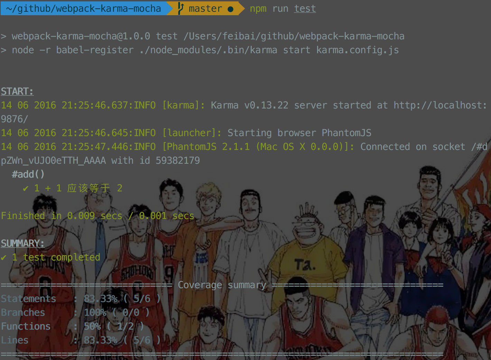

# webpack-karma-mocha  [](https://travis-ci.org/xwartz/webpack-karma-mocha)

webpack + karma + mocha + es6 前端单元测试组合

现在项目很多都使用了 `webpack` ，单元测试也得跟上节奏了。



## 使用

```
npm i
```

```
npm run test
```

## License
MIT
